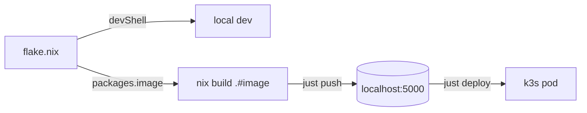

+++
title = 'The pipeline: dev → Nix image → k3s'
date = 2026-07-18T10:00:00-04:00
draft = true
tags = ["Homelab", "NixOS", "Kubernetes", "Nix", "k3s"]
featured_image = 'featured.png'
summary = 'How every project on my box gets built, shipped, and run — one flake.nix per project, a reproducible Nix image with no Dockerfile, deployed to a local k3s. The foundation post for the homelab section.'
+++

## Why this exists

For years "deploy this" meant: write a Dockerfile, `docker build`, hope the
image still builds in six months, push it somewhere, and pray the library
version inside the container matched the one I tested locally. Every project
reinvented its toolchain, and "works on my machine" survived every attempt to
kill it.

I wanted one shape for everything:

- Every project is a **`flake.nix`** — its dev environment *and* its production
  image declared in a single file.
- The image is **reproducible from a lock** — the same commit produces the same
  bytes, today or in two years.
- **No Dockerfile, no Docker daemon** to build or push.
- It deploys to a **local k3s cluster** I control, not someone else's cloud.

This post is the map of that pipeline — the foundation for everything else in
this section. The war stories (the crashes, the dead ends) get their own posts;
this one is the parts diagram.

**Versions on the box when I wrote this:** NixOS 26.05, k3s v1.35.6, Nix flake
support built in. Written 2026-07. These stacks drift — pin yours in any post
you write.

## How the pipeline works

Every project directory has a `flake.nix` that declares two outputs:

| Output | What it is |
|---|---|
| `devShells.default` | the dev tools — auto-loaded by `direnv` the moment you `cd` in |
| `packages.image` | a **reproducible OCI image** built by Nix (`dockerTools.buildImage`) — no Dockerfile |

A small `justfile` drives the loop between them:



```bash
just build    # nix build .#image   →  ./result  (the image tarball, no Dockerfile)
just push     # skopeo copy …       →  localhost:5000   (NO docker in the loop)
just deploy   # kubectl apply + rollout restart   →  k3s pulls the new image
```

`just deploy` chains `push`, which chains `build` — so one command does the
whole thing. The edit loop is just: **edit → `git add -A` → `just deploy`**.

The image is **fully reproducible from `flake.lock`** — same commit, same bytes.
No `pip install` at build time, no Dockerfile, no Docker daemon required to
build *or* push.

## How NixOS manages the whole pipeline

This is the part I like most, and it's the real headline: **the pipeline isn't
a pile of installed tools — it's a NixOS system.** My machine runs an "omni"
system flake (`~/.omni-nix`) that declaratively owns every layer of the
pipeline:

- **The toolchain** — `just`, `skopeo`, `kubectl`, `nix`, `direnv` — are system
  packages (`modules/apps/dev-tools.nix`). One `omni-apply` and they're on PATH
  everywhere, pinned to the system.
- **The project templates live *inside* that system flake**
  (`~/.omni-nix/templates/{python,hugo,react}`). So `nix flake init -t
  ~/.omni-nix#hugo` scaffolds a project from the system's *own* templates —
  they version with the system, not copied by hand and left to rot.
- **direnv + nix-direnv** auto-load each project's devShell on `cd`. The tools a
  project gives you aren't installed globally — they're declared in that
  project's `flake.nix` and materialized on demand into an isolated environment.
  Two projects can depend on different Hugos and never collide.
- **k3s is a NixOS systemd service** — on-demand (it does not start at boot),
  with state on `/persist` so workloads survive reboots.
- **The local registry is a NixOS module** (`labs/k8s-registry.nix`) that
  auto-starts alongside the cluster.

So NixOS manages the **build** (flakes), the **toolchain** (system packages),
the **cluster** (the k3s service), *and* the **registry** (a module) — one
declarative config runs the entire pipeline. Repave the box? Re-apply the
system flake and the whole thing — tools, templates, cluster, registry — comes
back, byte-for-byte. That's the payoff. That's why I'm not just "using Nix to
build images"; the box itself is the CI/CD platform.

## How to use it

### One-time setup

```bash
omni-apply                       # installs just + skopeo + kubectl + direnv (system-wide)
sudo systemctl start k3s         # k3s is on-demand — bring the cluster up
curl -s localhost:5000/v2/       # registry auto-starts → {}
```

(First-ever k3s start needs a one-time `sudo mkdir -p /persist/var/lib/rancher/k3s`.)

### Scaffold a project

```bash
mkdir ~/mysite && cd ~/mysite && git init
nix flake init -t ~/.omni-nix#hugo     # or #python / #react
git add -A && direnv allow
```

You get a `flake.nix`, `.envrc`, `justfile`, `manifests/`, and a sample app or
site to start from.

### Local dev

Run the **same entry point the image runs** — that's what catches version drift
between your dev environment and prod:

```bash
# Hugo
just serve                  # hugo server -D → http://localhost:1313

# Python (Flask / FastAPI)
uv venv && uv pip install -r app/requirements.txt
uv run uvicorn main:app --port 8080

# React
cd app && npm run dev        # → http://localhost:5173
```

### Deploy

```bash
git add -A                   # flakes read the git INDEX, not the working tree
just deploy                  # build → push → apply + rollout
just forward                 # port-forward → curl localhost:8080
```

## Gotchas worth knowing upfront

These bite everyone, me included (the next post is the full autopsy):

- **`git add` before `just build`/`deploy`.** Flakes read the *git index*, not
  the working tree. An unstaged file is invisible to the build — and it fails
  silently, with no error pointing at "you forgot to stage this."
- **Image name/tag stay in lockstep** across `flake.nix`, the `justfile`, and
  `manifests/*.yaml`. The default is a fixed `:latest` + `imagePullPolicy:
  Always` — that's intentional, not a mistake to "fix."
- **`.gitignore` has no inline comments.** `node_modules/  # deps` matches
  *nothing*; the `#…` becomes part of the pattern. I once had 1,439
  `node_modules/` files silently committed and baked into every image build
  because of this.
- **`just deploy`'s `rollout status` has no `--timeout`.** If the pod never goes
  `Ready`, it hangs forever and looks like a freeze. When iterating on a
  crashing pod, run `kubectl rollout status … --timeout=120s` by hand.

## Go deeper

- **The full reference manual:** `~/.omni-nix/PIPELINE.md` — this post is the
  tour; that's the nine-section manual (per-stack scaffolding, pod lifecycle,
  exposing services on the LAN, the full troubleshooting table).
- **direnv / dev-shell deep-dive:** `~/.omni-nix/DEV-ENVIRONMENTS.md`.
- **Also in this section:** _Hugo on k3s with Nix — three crashes and a dirty
  tree_ — what happened the first time I actually deployed a site through this
  pipeline, and the four failures it took to reach a `Running` pod.
